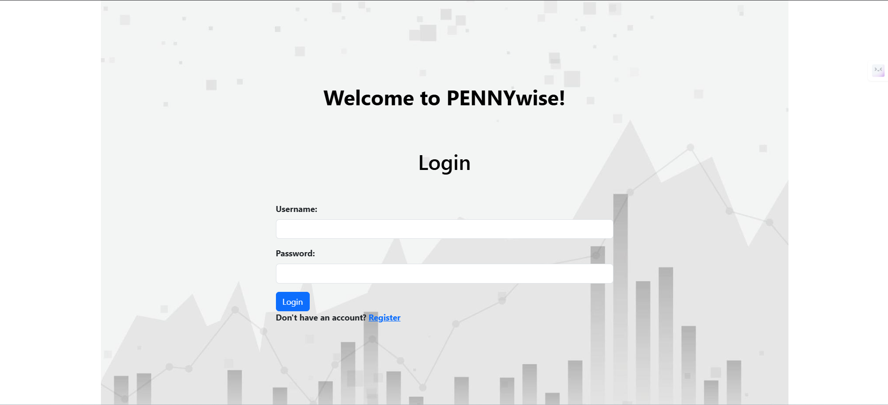
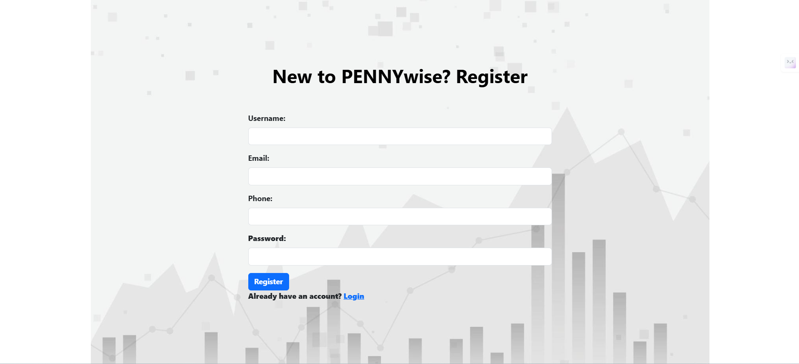
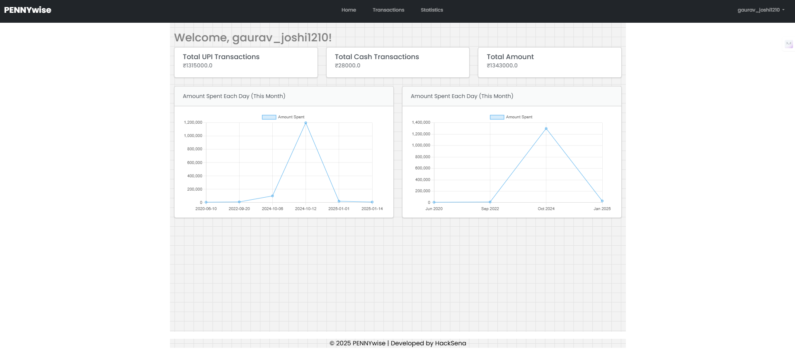
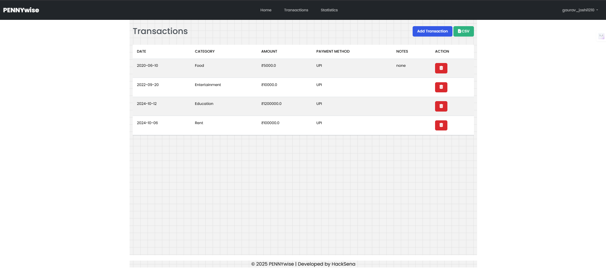
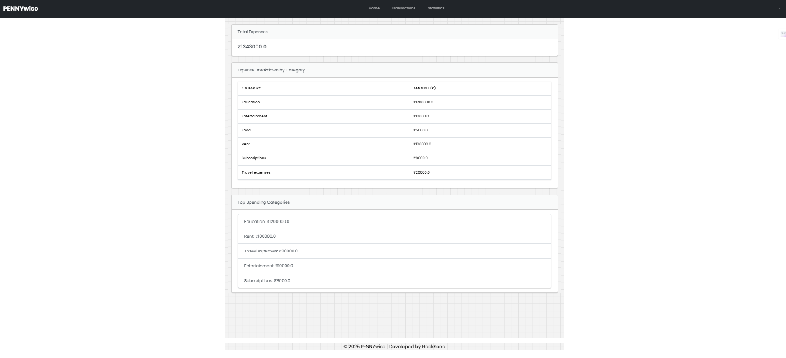

# PENNYwise

PENNYwise is a Flask-based web application which serves as a comprehensive finance tracker, enabling users to manage their expenses and income securely. It provides features for user registration, authentication, transaction management, and analytical insights into spending habits.

## Features

- **User Authentication**: Secure registration and login functionality.
- **Transaction Management**: Add, delete, and view expense and income transactions.
- **Analytics**: Insights into spending patterns by payment method and category.
- **Responsive Interface**: User-friendly design for easy navigation and interaction.

## Demo

<a href="https://drive.google.com/file/d/1dLR8XuroIwXyMJE7c7mmD5NRQUiGig1s/view?usp=sharing" target="_blank">PENNYwise-Demo</a>

## Screenshots

<!-- Add screenshots of your application here -->
#### Login Page

#### Registration Page

#### Dashboard

#### Transaction_page

#### Statistics page

## Contributing

Contributions are welcome! If you'd like to contribute to this project, please follow these steps:

1. Fork the repository.
2. Create a new branch (`git checkout -b feature/your_feature_name`).
3. Make your changes.
4. Commit your changes (`git commit -am 'Add some feature'`).
5. Push to the branch (`git push origin feature/your_feature_name`).
6. Create a new pull request.

## License

This project is licensed under the [MIT License](LICENSE).

## Acknowledgements

- [Flask](https://flask.palletsprojects.com/): Web framework for Python.
- [SQLite](https://www.sqlite.org/): Lightweight, serverless database engine.
- [Chart.js](https://www.chartjs.org/): JavaScript library for data visualization.
